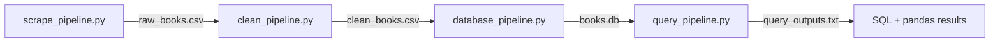

# /data_pipeline — Book Catalog Data Pipeline
 
This module scrapes live product data from books.toscrape.com, cleans it,
converts pricing to INR using a fixed project rate, loads it into a
normalized SQLite database, and queries it with both SQL and pandas.
 
## Pipeline flow
 

 
## Install
 
```
pip install -r requirements.txt
```
 
## Run order
 
The four scripts must be run in this order, since each one reads the
output file(s) produced by the previous step:
 
1. `python scrape_pipeline.py` — scrapes books.toscrape.com and saves `raw_books.csv`
2. `python clean_pipeline.py` — reads `raw_books.csv`, cleans it, and saves `clean_books.csv`
3. `python database_pipeline.py` — reads `clean_books.csv` and builds `books.db`
4. `python query_pipeline.py` — runs the SQL queries against `books.db` and saves `query_outputs.txt`
## Data source and scope
 
Books were scraped from books.toscrape.com across 4 categories (Travel,
Mystery, Historical Fiction, Sequential Art), yielding 144 book rows —
above the required minimum of 60 books across at least 3 categories. For
each book, `title`, `price` (GBP, as listed), `star_rating` (text), and
`availability` (text) were captured, along with its `category`.
 
## Currency conversion
 
`price_gbp` is converted to `price_inr` using the fixed project-defined
rate:
 
**1 GBP = 105.50 INR**
 
This is a fixed, artificial baseline rate for this assignment, not a live
or historical market rate, and requires no external API call.
 
## Cleaning decisions (`clean_pipeline.py`)
 
- **Price:** the `£` symbol is stripped from `price` and the remainder is
  converted to a float (`price_gbp`). Values that fail to convert become
  `NaN` and are later filled with the column's **median** price.
- **Rating:** the text rating (`One`…`Five`) is mapped to an integer
  (1–5). Values that don't match this vocabulary become `NaN` and are
  later filled with the column's **median** rating, then rounded to the
  nearest integer.
- **Availability:** text starting with "in stock" is mapped to `True`;
  text starting with "out of stock" is mapped to `False`. Any other or
  missing value is treated as **out of stock (`False`)**, since unstated
  availability is assumed unsafe to sell against.
- **Title / category:** both are stripped of surrounding whitespace. Rows
  with an empty `title` or `category` are **dropped**, since these are
  required identifying fields and cannot be reasonably imputed.
- Numeric fields (`price_gbp`, `rating`) use median imputation rather than
  being dropped, since a missing price or rating does not prevent the row
  from otherwise being a valid book record.
## Database schema (`database_pipeline.py`)
 
Two tables in `books.db`, linked by a primary/foreign key relationship:
 
```sql
categories(category_id INTEGER PRIMARY KEY, category_name TEXT UNIQUE NOT NULL)
 
books(
    book_id INTEGER PRIMARY KEY,
    title TEXT NOT NULL,
    price_gbp REAL,
    price_inr REAL,
    rating INTEGER,
    in_stock INTEGER,
    category_id INTEGER REFERENCES categories(category_id)
)
```
 
`database_pipeline.py` drops and recreates both tables each run, so it can
be re-run at any time to regenerate `books.db` from `clean_books.csv`.
 
## SQL queries (`query_pipeline.py`)
 
Five queries are executed against `books.db`, and their query text and
output are saved to `query_outputs.txt`:
 
1. **SELECT / WHERE** — books with `rating >= 4`.
2. **ORDER BY** — all books ordered by `price_gbp` descending.
3. **LIMIT** — the first 10 books.
4. **DISTINCT** — the distinct category names.
5. **IN / JOIN** — books joined to their category, filtered to
   `rating IN (4, 5)`, ordered by rating descending, limited to 10 rows.
## pandas verification
 
Two of the query results above are also read into pandas with
`pd.read_sql(...)`. Separately, the Query 5 join is reproduced without SQL
by loading the `books` and `categories` tables into DataFrames and joining
them with `pd.merge(...)` on `category_id`. Both the SQL result and the
pandas `merge` result are printed and saved to `query_outputs.txt`, and
the two outputs match.
 